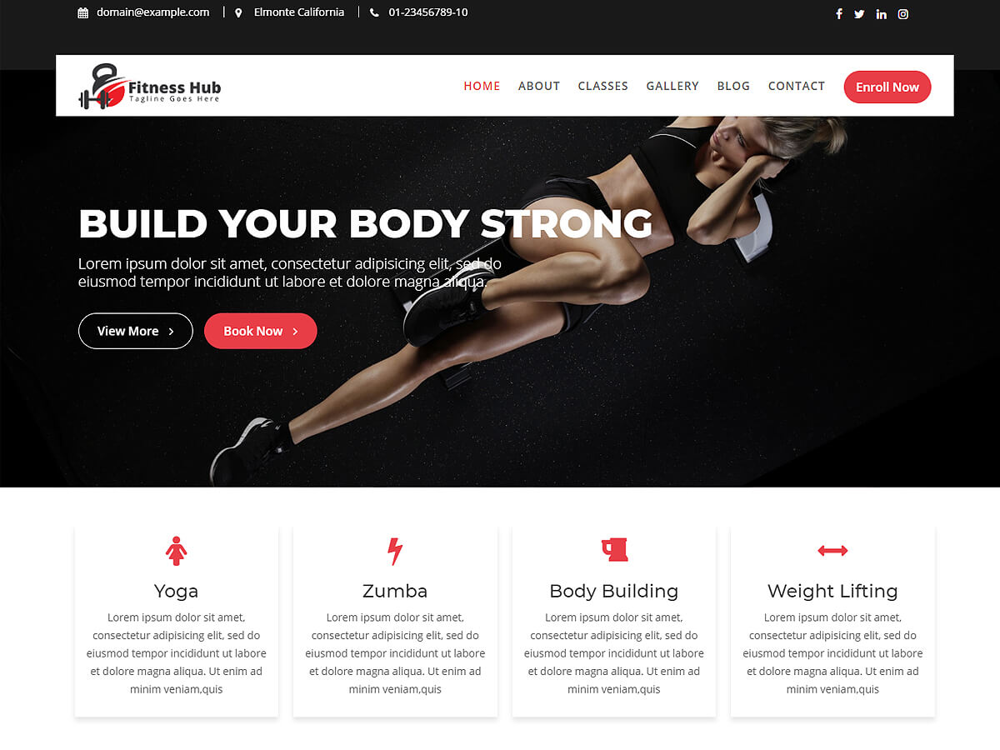

# Fitness Hub

**Contributors:** acmethemes  
**Requires at least:** 6.6  
**Tested up to:** 7.0  
**Requires PHP:** 7.4  
**Stable tag:** 4.0.0  
**License:** GPLv2 or later  
**License URI:** https://www.gnu.org/licenses/gpl-2.0.html  

> 

Fitness Hub is a modern, energetic WordPress theme built for gyms, fitness studios, yoga classes, and health clubs. It gives you everything you need to showcase your services, promote classes, and attract new members — with WooCommerce integration to sell memberships, gear, and supplements online.

## Features

- **Unlimited featured slider** — promote classes, offers, and events
- **Up to four-column layouts** — flexible grids for services and trainers
- **Post formats** — standard, gallery, image, and video for workout demos
- **Page builder compatible** — works with SiteOrigin and others
- **WooCommerce compatible** — sell memberships, apparel, and equipment
- **Custom colors & background** — match your brand energy
- **Custom logo** — upload your gym logo
- **Footer widgets** — hours, contact, social links, and class schedules
- **Editor-style support** — consistent editing experience
- **Translation ready** — .pot file included
- **RTL support** — right-to-left language compatible
- **Responsive** — looks great on phones, tablets, and desktops

## Installation

1. Download the theme zip file.
2. In your WordPress admin, go to **Appearance → Themes**.
3. Click **Add New** → **Upload Theme**.
4. Select the zip file and click **Install Now**.
5. Click **Activate**.

## Frequently Asked Questions

### How do I install the theme?

In your admin panel, go to **Appearance → Themes**, click **Add New**, upload the zip file, and click **Activate**.

### How do I customize the theme?

Go to **Appearance → Customize** — adjust layout, slider, colors, and widgets from one screen.

## Credits

Fitness Hub is built on [Underscores](https://underscores.me/) and licensed under GPLv2 or later. It bundles the following third-party resources:

- [Google Fonts](https://fonts.google.com/) — Apache License 2.0
- [Font Awesome](https://fontawesome.com/) — MIT / SIL OFL 1.1
- [normalize.css](https://necolas.github.io/normalize.css/) — MIT
- [Bootstrap](http://getbootstrap.com/) — MIT
- [Theia Sticky Sidebar](https://github.com/WeCodePixels/theia-sticky-sidebar) — MIT
- [Breadcrumb Trail](https://github.com/justintadlock/breadcrumb-trail) — GPLv2+
- [TGM Plugin Activation](http://tgmpluginactivation.com/) — GPLv2+
- [html5shiv](https://github.com/afarkas/html5shiv) — MIT
- [Respond.js](https://github.com/scottjehl/Respond) — MIT

---

[Support](https://www.acmethemes.com/supports/) &middot; [Acme Themes](https://www.acmethemes.com)
